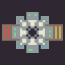

# irre-tools

toy handwritten assembler, emulator, compiler, toolchain for a lightweight RISC architecture 

## documentation

documentation and specifications ([arch](doc/arch.md), [asm](doc.asm.md)) are available in [doc](doc/).

## hacking

grab submodules:
```sh
git submodule update --init --recursive
```

install dependencies:
+ c compiler
+ dlang compiler + dub

### quickstart build
```sh
# build everything and export $VBCC and $IRRE
. ./script/build_tools.sh
```

tools you now have:
+ `$IRRE/irretool` (irre multitool)
+ `$VBCC/bin/vbccirre` (c->irre cross compiler)

### full build
build the irre multitool `irretool`
```sh
cd src/irretool
dub build
```

build the custom vbcc port for IRRE:
```sh
export VBCC=$(pwd)/tools/vbcc
cd tools/vbcc
mkdir -p bin
make TARGET=irre all bin/vbccirre # press enter for default answers
```

### compile a C program

```c
// my_prog.c

int add(int a, int b) {
    return a + b;
}

int main() {
    int a = 3;
    int b = 4;
    int sum = add(a, b);
    return sum;
}

```

now build and run:
```sh
# build (creates my_prog.bin)
./script/irre_cc.sh my_prog.c my_prog
# run
$IRRE/irretool -v emu my_prog.bin
```
